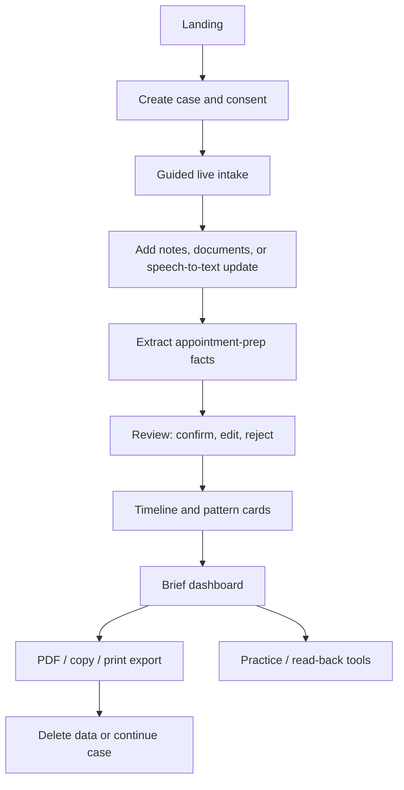
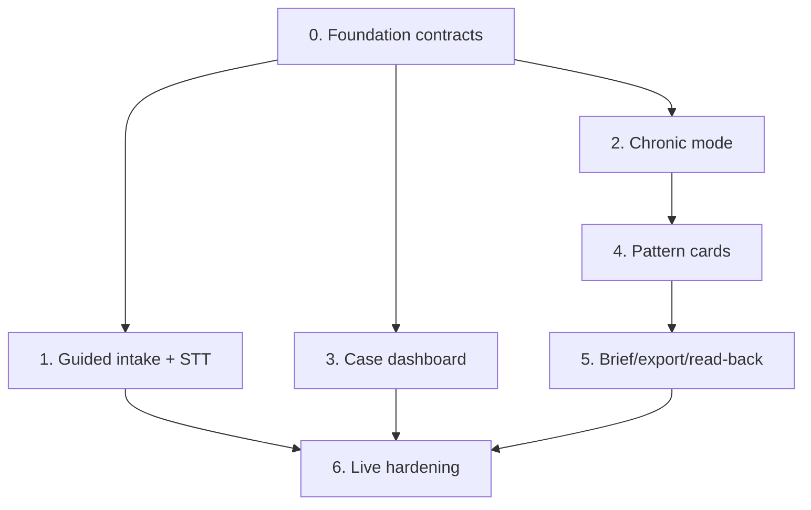

# Chronic Live Flow Improvement Plan

Status: implementation plan for the next ClinicBrief product pass.
Date: 2026-06-19.

## Purpose

This pass turns ClinicBrief from a reliable appointment-brief MVP into a stronger live product for people with complex or chronic health stories.

The product direction is:

> ClinicBrief helps a patient or carer turn messy health history into a reviewed, source-linked, clinician-ready appointment brief.

This is not a Juno clone. Juno is strongest as an always-on chronic illness companion. ClinicBrief should be strongest at the high-stakes appointment-preparation moment: "I have limited time with a clinician. Help me bring the right story, the right timeline, and the right questions."

## Research Basis

Juno references:

- YC company page: https://www.ycombinator.com/companies/juno-chat
- YC launch post: https://www.ycombinator.com/launches/QT7-juno-ai-health-assistant-for-chronic-illness
- Juno site: https://junocompanion.com/
- Juno AI guide: https://junocompanion.com/llms.txt
- Juno example report: https://junocompanion.com/example-report
- App Store lookup: https://itunes.apple.com/lookup?id=6749455368

Useful Juno patterns to adapt safely:

- Low-friction capture through text and voice.
- Longitudinal health profile.
- Pattern and flare review over time.
- Appointment-ready PDF summaries.
- Condition-aware structure.
- Supportive language for chronic illness users.

Patterns ClinicBrief should avoid:

- Personalized symptom advice.
- Diagnosis acceleration claims.
- Treatment recommendations.
- Medication or dose advice.
- Emergency triage.
- Always-on companion promises that the current web app cannot reliably support.

## Product Guardrails

Required safety copy remains:

> ClinicBrief organizes information you provide so you can prepare for appointments. It does not diagnose, recommend treatment, or replace medical advice. Review everything before sharing it with a clinician.

Allowed:

- Organize user-provided facts.
- Extract appointment-prep facts from user-provided sources.
- Ask missing-context questions.
- Help users phrase their own history.
- Highlight repeated patterns as hypotheses to discuss with a clinician.
- Generate reviewed clinician-readable briefs and PDFs.
- Use browser speech-to-text for note capture.
- Optionally read back user-reviewed summaries with text-to-speech.

Not allowed:

- Diagnose.
- Recommend treatment.
- Recommend medication changes.
- Interpret urgency or emergency severity.
- Score clinical risk.
- Send raw health content to analytics.
- Use unreviewed AI output in final briefs.

## Target Live User Flow



## Major Improvements

### 1. Guided Live Intake

Problem:

The current live flow can feel too blank. Users may not know what to paste or upload, especially if they are not using the synthetic demo.

Goal:

Create a structured intake wizard that collects enough context to make the first extraction useful.

Proposed steps:

1. Appointment goal
   - "What is this appointment for?"
   - Appointment type: GP, consultant, pre-op, specialist, carer handoff, other.
   - Main question or concern.

2. Health story starter
   - Short free-text prompt: "What has been happening?"
   - Optional browser speech-to-text input.
   - Typed fallback always available.

3. Timeline anchors
   - When did this begin?
   - What changed recently?
   - Last appointment or test date, if known.

4. Current meds and allergies
   - Medication names as user-reported text only.
   - Allergies and important notes.
   - No advice, dose checking, or interactions.

5. Documents
   - Upload PDF/text/image.
   - Paste copied text.
   - Manual fallback when PDF/image text is not extractable.

6. Review before extraction
   - Show source count and input types.
   - Clear "Extract facts for review" action.

Implementation notes:

- Keep the existing `/cases/[caseId]/intake` route.
- Add a multi-step client component rather than a separate onboarding product.
- Store each intake answer as source-backed text documents or structured case metadata.
- Use explicit source labels such as "Guided intake: appointment goal" and "Guided intake: timeline anchors".
- Do not store speech audio. Store only the user-confirmed transcript.

Acceptance criteria:

- A first-time user can create a useful case without uploading a file.
- The intake page has a clear next action at every step.
- Speech-to-text failure never blocks typed input.
- All submitted guided answers appear as extractable source material.

### 2. Chronic Illness Mode

Problem:

The current case modes are broad, and the live product does not yet feel specifically useful for chronic illness or complex longitudinal histories.

Goal:

Add a chronic/longitudinal case mode that captures the information clinicians need to scan quickly.

Suggested mode name:

- `CHRONIC`

Mode-specific intake fields:

- Confirmed diagnoses, if any, as "reported history".
- Possible conditions being investigated, clearly separated from confirmed diagnoses.
- Baseline symptoms.
- Flares or episodes.
- Current medications and treatments tried, user-reported only.
- Functional impact.
- Triggers as hypotheses, not conclusions.
- What changed since the last appointment.
- Questions the user wants answered.

Supported appointment focus options:

- GP review.
- Consultant/specialist visit.
- Rheumatology.
- Neurology.
- Gastroenterology.
- Endocrinology.
- Pain clinic.
- Gynaecology.
- Long COVID / fatigue clinic.
- Carer handoff.
- General chronic illness review.

Data model approach:

- Prefer extending existing flexible `CaseMode`, fact categories, and `value` payloads before adding many new tables.
- Add narrow new types only where they improve safety or UI clarity.
- Keep Prisma migration impact small.

Acceptance criteria:

- Chronic mode changes intake prompts, missing questions, timeline grouping, and brief copy.
- Confirmed diagnoses and suspected/investigated conditions are visually separate.
- The app never claims to diagnose or confirm a condition.
- Chronic mode works with memory fallback and Prisma.

### 3. Doctor-Ready Dashboard

Problem:

Current routes work, but the user has to understand the workflow across multiple pages. The live product should feel more guided and appointment-oriented.

Goal:

Create a case dashboard that makes the state of the appointment brief obvious.

Recommended route:

- `/cases/[caseId]`

Dashboard sections:

- Preparation status:
  - intake complete/incomplete;
  - extraction ready/done;
  - facts needing review;
  - timeline ready;
  - brief ready;
  - export ready.

- What changed since last appointment:
  - pulled from timeline and user answers;
  - marked as user-reviewed or needs review.

- Top points to raise:
  - 3 to 5 short user-reviewed items;
  - source-linked;
  - no treatment advice.

- Open questions:
  - missing-context questions;
  - user-entered questions for the clinician.

- Source coverage:
  - document count;
  - source types;
  - sections with weak or missing evidence.

- Next action:
  - a single primary CTA based on state.

Acceptance criteria:

- After case creation, users land somewhere that tells them exactly what to do next.
- The dashboard can recover from partial progress.
- No page requires external AI credentials to render.
- Dashboard state is derived from existing repository data.

### 4. Speech-To-Text And Optional Text-To-Speech

Problem:

Conversational AI is not required. The more useful and safer voice feature is simple capture and read-back.

Goal:

Add voice as an accessibility and low-energy input method, not as an autonomous health assistant.

Speech-to-text:

- Use browser Web Speech API where available.
- Available on guided intake and quick update.
- User can edit transcript before saving.
- Do not auto-submit transcript.
- Do not send audio to ClinicBrief servers.
- If unsupported, show typed input only.

Text-to-speech:

- Use browser SpeechSynthesis where available.
- Read back the 90-second story or brief sections.
- User-triggered only.
- No server-side voice generation needed for this pass.

Privacy copy:

- "Speech recognition is handled by your browser where available. ClinicBrief stores only text you choose to save."
- If browser/vendor handling cannot be guaranteed for a browser, phrase as: "Your browser may process speech recognition. Review your transcript before saving."

Implementation notes:

- Add a small client utility under `apps/web/lib/client/speech.ts` or route-local hooks.
- Do not add external STT/TTS dependencies unless browser support is insufficient.
- Analytics may track `speech_supported`, `speech_started`, `speech_saved` counts only. No transcript.

Acceptance criteria:

- Voice input can populate an editable text area.
- Unsupported browsers degrade cleanly.
- Text-to-speech can read the 90-second story if available.
- No raw transcript is sent to analytics.

### 5. Review-First Pattern Cards

Problem:

Pattern detection is compelling, but unsafe if presented as clinical interpretation.

Goal:

Surface repeated user-provided patterns as reviewable appointment-prep cards.

Safe wording:

- "Possible pattern to discuss"
- "Seen in your notes"
- "Needs review"
- "Hypothesis for appointment discussion"

Unsafe wording:

- "Cause"
- "Diagnosis"
- "You should"
- "This means"
- "Treatment plan"

Pattern card examples:

- "Three notes mention fatigue worsening after busy days. Confirm whether this is accurate before adding it to your brief."
- "Two sources mention medication side effects. Confirm the wording you want to discuss with your clinician."
- "Recent notes mention symptoms affecting work. Add one concrete example for your appointment."

Pattern inputs:

- Reviewed facts.
- Timeline events.
- Source document dates if present.
- Guided intake fields.

Pattern outputs:

- Reviewable cards, not final claims.
- Each card has source facts and confidence.
- User can confirm, edit, reject.

Implementation notes:

- Consider a server service: `pattern-service.ts`.
- Add a strict schema if Fireworks is used.
- Deterministic fallback should produce simple grouped cards from repeated categories and timeline changes.
- Store confirmed pattern cards as facts or timeline annotations only after user review.

Acceptance criteria:

- Pattern cards never appear in a final brief unless user-reviewed.
- Cards cite their source facts.
- The deterministic fallback produces useful cards with no AI credentials.
- Safety tests reject diagnostic/treatment language.

### 6. Live Flow Reliability And Quality

Problem:

The demo path is strong, but live users and judges will test the real flow. Loading and error states must be boringly reliable.

Goal:

Make the live path resilient enough for public judging.

Reliability requirements:

- Every mutation has:
  - pending state;
  - timeout;
  - retry or recovery copy;
  - clear error message;
  - no permanent stuck UI.

- Every workflow has:
  - a primary next step;
  - a back path;
  - partial-progress support.

- Every external dependency has:
  - local fallback;
  - readiness state;
  - non-secret diagnostics.

Key flows to harden:

- Create case.
- Add text note.
- Upload document.
- Extract.
- Review fact.
- Rebuild timeline.
- Generate brief.
- Generate export.
- Delete case.

Acceptance criteria:

- `pnpm smoke:memory` and `pnpm smoke:full` pass.
- Manual live flow can complete without using the demo route.
- Vercel production can create a case, add text, extract, review, brief, export, and delete.
- No spinner can remain forever without a timeout or refresh guidance.

## Suggested Workstreams

Use one sequential foundation session first, then parallelize.

### Workstream 0: Foundation Contracts

Purpose:

Define shared types, mode names, route strategy, speech utility contracts, and dashboard state so parallel agents do not collide.

Owned files:

- `docs/chronic-live-flow-improvement-plan.md`
- `docs/full-agentic-production-source-of-truth.md`
- `packages/types/src/**`
- `.env.example` only if new public feature flags are needed
- API response contracts if needed

Tasks:

1. Add or confirm `CHRONIC` case mode.
2. Define guided intake source types.
3. Define pattern card type.
4. Define case dashboard state type.
5. Define browser speech feature contract.
6. Add tests for type/schema expectations.

Verification:

- `pnpm --filter @clinicbrief/types test`
- `pnpm typecheck`
- `pnpm lint`

Merge order:

- Must land first.

### Workstream 1: Guided Intake And Voice Capture

Purpose:

Make live case intake useful without uploads and add safe speech-to-text capture.

Owned files:

- `apps/web/app/cases/[caseId]/intake/**`
- `apps/web/app/api/cases/[caseId]/documents/route.ts`
- `apps/web/lib/client/**` if created
- focused tests

Tasks:

1. Replace or extend the intake client with a guided stepper.
2. Save guided answers as source documents or structured source previews.
3. Add browser speech-to-text hook with typed fallback.
4. Add transcript edit-before-save behavior.
5. Add "sample text for live flow" helper using synthetic data only.
6. Improve extraction handoff and success/error states.

Verification:

- `pnpm --filter @clinicbrief/web test`
- `pnpm typecheck`
- `pnpm lint`
- manual local `/cases/new -> intake -> extract`

Merge order:

- After Workstream 0.

### Workstream 2: Chronic Mode And Missing Questions

Purpose:

Make the live product specifically useful for chronic illness and complex longitudinal histories.

Owned files:

- `apps/web/app/cases/new/**`
- `apps/web/lib/server/extraction-service.ts`
- `apps/web/lib/server/brief-service.ts`
- `packages/ai/src/prompts.ts`
- `packages/ai/src/schemas.ts`
- `packages/types/src/**`
- focused tests

Tasks:

1. Add chronic mode to case creation UI.
2. Separate confirmed diagnoses from suspected/investigated conditions.
3. Add chronic-specific fallback missing questions.
4. Add chronic-specific AI extraction prompt constraints.
5. Add chronic brief variant or chronic-aware sections.
6. Ensure unsafe advice prompts continue to redirect.

Verification:

- `pnpm --filter @clinicbrief/ai test`
- `pnpm --filter @clinicbrief/web test`
- `pnpm typecheck`
- `pnpm lint`

Merge order:

- After Workstream 0.
- Can run parallel with Workstream 1 if file ownership is respected.

### Workstream 3: Case Dashboard

Purpose:

Add one coherent home for the live case, state, and next action.

Owned files:

- `apps/web/app/cases/[caseId]/page.tsx`
- `apps/web/app/cases/[caseId]/**` shared navigation components if needed
- `apps/web/lib/server/clinic-repository/**` only if dashboard selectors need helpers
- focused tests

Tasks:

1. Add `/cases/[caseId]` route.
2. Compute preparation status from existing case data.
3. Show next best action.
4. Show top points, open questions, source coverage, and timeline summary.
5. Update post-create and post-step navigation to use dashboard where helpful.
6. Ensure demo case and real cases both render.

Verification:

- `pnpm --filter @clinicbrief/web test`
- `pnpm typecheck`
- `pnpm lint`
- manual local dashboard flow

Merge order:

- After Workstream 0.
- Ideally after Workstream 1 for best navigation, but can start in parallel using existing data.

### Workstream 4: Review-First Pattern Cards

Purpose:

Add safe pattern hypotheses that users can approve before they affect briefs.

Owned files:

- `apps/web/lib/server/pattern-service.ts`
- `apps/web/app/api/cases/[caseId]/patterns/**`
- `apps/web/app/cases/[caseId]/timeline/**`
- `apps/web/app/cases/[caseId]/review/**` if cards are reviewed there
- `packages/ai/src/**` if AI patterns are added
- focused tests

Tasks:

1. Implement deterministic pattern card generation.
2. Add optional Fireworks pattern generation through strict schema.
3. Add API endpoint to list/generate pattern cards.
4. Add UI for confirm/edit/reject.
5. Add confirmed cards to brief input only after review.
6. Add safety tests for forbidden language.

Verification:

- `pnpm --filter @clinicbrief/ai test`
- `pnpm --filter @clinicbrief/web test`
- `pnpm typecheck`
- `pnpm lint`

Merge order:

- After Workstream 0.
- Best after Workstream 2 if chronic mode adds categories.

### Workstream 5: Brief, Export, And Read-Back Polish

Purpose:

Make the final output feel clinician-readable and useful for chronic mode.

Owned files:

- `apps/web/app/cases/[caseId]/brief/**`
- `apps/web/app/cases/[caseId]/export/**`
- `apps/web/app/api/cases/[caseId]/export/route.ts`
- `packages/exports/**`
- `apps/web/lib/client/**` for text-to-speech if created
- focused tests

Tasks:

1. Add chronic-aware brief sections.
2. Add "what changed since last appointment" section when available.
3. Add "top points to raise" and "questions for clinician".
4. Add text-to-speech read-back for 90-second story.
5. Ensure PDF includes reviewed patterns only.
6. Keep Markdown/print fallback.

Verification:

- `pnpm --filter @clinicbrief/exports test`
- `pnpm --filter @clinicbrief/web test`
- `pnpm typecheck`
- `pnpm lint`
- `pnpm build`

Merge order:

- After Workstreams 2 and 4.

### Workstream 6: Live Flow Hardening And Smoke

Purpose:

Remove stuck states and prove the public live flow works end to end.

Owned files:

- `scripts/smoke-check.mjs`
- route clients with mutation states
- `docs/final-integration-handoff.md`
- `docs/demo-script.md`
- focused tests

Tasks:

1. Audit every client mutation for pending/error/timeout/retry behavior.
2. Add production smoke for live case path using synthetic data.
3. Add checks for dashboard, chronic mode, pattern cards, brief, export, delete.
4. Run local fallback smoke.
5. Run credentialed smoke if env is available.
6. Deploy and test Vercel production.
7. Update final handoff with evidence.

Verification:

- `pnpm typecheck`
- `pnpm lint`
- `pnpm test`
- `pnpm build`
- `pnpm smoke:memory`
- `pnpm smoke:full`
- credentialed `pnpm smoke:ai`, `pnpm smoke:db`, `pnpm smoke:storage` when env is available
- website quality audit against `apps/web`

Merge order:

- Last.

## Recommended Parallelization

Do not launch all six at once. The cleanest execution plan is:



Recommended sessions:

1. Run Workstream 0 sequentially.
2. Run Workstreams 1, 2, and 3 in parallel.
3. Merge and verify.
4. Run Workstreams 4 and 5, with 5 starting after 4 has its contracts or using a shared branch if time is short.
5. Run Workstream 6 as final integration.

## Agent Prompts

### Prompt 0: Foundation Contracts

```text
You are working in the ClinicBrief repo.

First read:
- AGENTS.md
- clinicbrief_agent_source_of_truth.md
- clinicbrief_build_ready_spec.md
- docs/ui-design-brief.md
- docs/full-agentic-production-source-of-truth.md
- docs/chronic-live-flow-improvement-plan.md

Create your own isolated worktree/branch from main:
git worktree add -b agent/chronic-foundation-contracts .worktrees/chronic-foundation-contracts main

Do not edit other worktrees.

Goal:
Add shared contracts for the chronic/live-flow improvement pass.

Owned files:
- packages/types/src/**
- packages/ai/src/schemas.ts only if schemas need shared contract updates
- docs/full-agentic-production-source-of-truth.md
- docs/chronic-live-flow-improvement-plan.md
- tests

Requirements:
- Add/confirm CHRONIC case mode.
- Define guided intake source/document metadata shape if needed.
- Define review-first pattern card type.
- Define case dashboard state type.
- Define browser speech feature contract if needed.
- Preserve all safety guardrails.
- Do not implement UI in this branch.

Verification:
- pnpm --filter @clinicbrief/types test
- pnpm typecheck
- pnpm lint

Commit when done.

Final handoff must include branch/worktree, files changed, contracts added, commands run/results, risks, and next merge order.
```

### Prompt 1: Guided Intake And Speech-To-Text

```text
You are working in the ClinicBrief repo.

First read the same source docs plus docs/chronic-live-flow-improvement-plan.md.

Create your own isolated worktree/branch from main after foundation is merged:
git worktree add -b agent/chronic-guided-intake .worktrees/chronic-guided-intake main

Goal:
Make the live intake path guided, useful without uploads, and safe for browser speech-to-text.

Owned files:
- apps/web/app/cases/[caseId]/intake/**
- apps/web/app/api/cases/[caseId]/documents/route.ts
- apps/web/lib/client/** if needed
- focused tests

Requirements:
- Multi-step intake for appointment goal, story starter, timeline anchors, meds/allergies, documents, extraction handoff.
- Save guided answers as source material for extraction.
- Add browser speech-to-text for note fields with edit-before-save and typed fallback.
- Do not store audio.
- Do not send transcript text to analytics.
- Add useful pending/error/timeout states.

Verification:
- pnpm --filter @clinicbrief/web test
- pnpm typecheck
- pnpm lint
- pnpm build

Commit when done.
```

### Prompt 2: Chronic Mode

```text
You are working in the ClinicBrief repo.

First read the same source docs plus docs/chronic-live-flow-improvement-plan.md.

Create your own isolated worktree/branch from main after foundation is merged:
git worktree add -b agent/chronic-mode .worktrees/chronic-mode main

Goal:
Add chronic/longitudinal mode across case creation, extraction, missing questions, and brief generation.

Owned files:
- apps/web/app/cases/new/**
- apps/web/lib/server/extraction-service.ts
- apps/web/lib/server/brief-service.ts
- packages/ai/src/prompts.ts
- packages/ai/src/schemas.ts
- packages/types/src/**
- focused tests

Requirements:
- Add CHRONIC mode UI.
- Separate confirmed diagnoses from suspected/investigated conditions.
- Add chronic-specific missing questions.
- Add chronic-specific extraction and brief instructions.
- Keep all outputs appointment-prep only.
- No diagnosis, treatment, medication-change, urgency, or risk scoring.

Verification:
- pnpm --filter @clinicbrief/ai test
- pnpm --filter @clinicbrief/web test
- pnpm typecheck
- pnpm lint
- pnpm build

Commit when done.
```

### Prompt 3: Case Dashboard

```text
You are working in the ClinicBrief repo.

First read the same source docs plus docs/chronic-live-flow-improvement-plan.md.

Create your own isolated worktree/branch from main after foundation is merged:
git worktree add -b agent/case-dashboard .worktrees/case-dashboard main

Goal:
Add a case dashboard at /cases/[caseId] that guides the live user through the next best action.

Owned files:
- apps/web/app/cases/[caseId]/page.tsx
- apps/web/app/cases/[caseId]/** shared components if needed
- focused tests

Requirements:
- Show preparation status.
- Show next best action.
- Show top points/open questions/source coverage/timeline summary from existing data.
- Update navigation after create/intake/review where appropriate.
- Must render for demo and real cases.
- No external credentials required.

Verification:
- pnpm --filter @clinicbrief/web test
- pnpm typecheck
- pnpm lint
- pnpm build

Commit when done.
```

### Prompt 4: Pattern Cards

```text
You are working in the ClinicBrief repo.

First read the same source docs plus docs/chronic-live-flow-improvement-plan.md.

Create your own isolated worktree/branch from main after chronic mode is merged:
git worktree add -b agent/review-first-patterns .worktrees/review-first-patterns main

Goal:
Add review-first pattern cards that surface repeated source-backed appointment-prep hypotheses safely.

Owned files:
- apps/web/lib/server/pattern-service.ts
- apps/web/app/api/cases/[caseId]/patterns/**
- apps/web/app/cases/[caseId]/timeline/**
- apps/web/app/cases/[caseId]/review/** if needed
- packages/ai/src/** if AI pattern generation is added
- focused tests

Requirements:
- Deterministic fallback pattern generation from reviewed/source-backed data.
- Optional Fireworks pattern generation only through strict schema.
- Cards must say possible pattern/hypothesis to discuss, not cause/diagnosis/advice.
- Cards must cite source fact IDs.
- User must confirm/edit/reject before use in brief.
- Add safety tests for forbidden language.

Verification:
- pnpm --filter @clinicbrief/ai test
- pnpm --filter @clinicbrief/web test
- pnpm typecheck
- pnpm lint
- pnpm build

Commit when done.
```

### Prompt 5: Brief, Export, And Read-Back

```text
You are working in the ClinicBrief repo.

First read the same source docs plus docs/chronic-live-flow-improvement-plan.md.

Create your own isolated worktree/branch from main after chronic mode and pattern contracts are merged:
git worktree add -b agent/chronic-brief-export-readback .worktrees/chronic-brief-export-readback main

Goal:
Polish brief/export for chronic live flow and add safe browser text-to-speech read-back.

Owned files:
- apps/web/app/cases/[caseId]/brief/**
- apps/web/app/cases/[caseId]/export/**
- apps/web/app/api/cases/[caseId]/export/route.ts
- packages/exports/**
- apps/web/lib/client/** if needed
- focused tests

Requirements:
- Chronic-aware brief sections.
- Include what changed since last appointment when available.
- Include top points, clinician questions, uncertainties, source coverage, and safety disclaimer.
- Include reviewed pattern cards only.
- Add browser SpeechSynthesis read-back for 90-second story or brief section.
- Keep PDF, browser print, Markdown/copy fallback.

Verification:
- pnpm --filter @clinicbrief/exports test
- pnpm --filter @clinicbrief/web test
- pnpm typecheck
- pnpm lint
- pnpm build

Commit when done.
```

### Prompt 6: Final Integration And Live Hardening

```text
You are working in the ClinicBrief repo.

First read all source docs plus docs/chronic-live-flow-improvement-plan.md.

Create your own isolated worktree/branch from main after all feature branches are merged:
git worktree add -b agent/chronic-live-final-integration .worktrees/chronic-live-final-integration main

Goal:
Harden the full live flow, add smoke coverage, update docs, and verify deploy readiness.

Owned files:
- scripts/smoke-check.mjs
- route clients that still have weak loading/error states
- docs/final-integration-handoff.md
- docs/demo-script.md
- docs/devpost-submission-draft.md if product copy changes
- focused tests

Requirements:
- Audit create, intake, extract, review, timeline, brief, export, delete for stuck states.
- Add or extend smoke flow for real case path with synthetic data.
- Verify chronic mode, dashboard, guided intake, pattern cards, read-back, export, delete.
- Keep demo path intact.
- Keep analytics sanitized.
- Run full checks.

Verification:
- pnpm typecheck
- pnpm lint
- pnpm test
- pnpm build
- pnpm smoke:memory
- pnpm smoke:full
- credentialed smokes if env is available
- website quality audit against apps/web

Commit when done and leave branch clean.
```

## Final Acceptance Checklist

Product:

- Live case creation does not get stuck.
- User can complete real flow without demo cache.
- User can create a chronic mode case.
- User can add typed notes without uploading files.
- User can use speech-to-text if browser supports it.
- User can review/edit/reject all extracted facts.
- User can view dashboard state and next action.
- User can see safe pattern cards and approve/reject them.
- User can generate a clinician-readable brief.
- User can export PDF or fallback Markdown/print.
- User can delete case data.

Safety:

- Required disclaimer appears on landing, consent, brief, and export surfaces.
- No diagnosis/treatment/medication/urgency advice.
- Pattern cards are hypotheses to discuss, not medical conclusions.
- AI output is schema-checked and review-gated.
- No raw health text in analytics.
- Speech transcript is not tracked as analytics.

Technical:

- Memory fallback works.
- Fireworks fallback works when credentials are absent.
- Fireworks smoke works when credentials are present.
- Prisma/Supabase smoke works when credentials are present.
- Supabase storage smoke works when credentials are present.
- Vercel production env is documented.
- Novus remains a final submission integration, not a dependency for product function.

Verification:

- `pnpm typecheck`
- `pnpm lint`
- `pnpm test`
- `pnpm build`
- `pnpm smoke:memory`
- `pnpm smoke:full`
- credentialed smokes when env is present
- website quality audit
- manual production smoke

